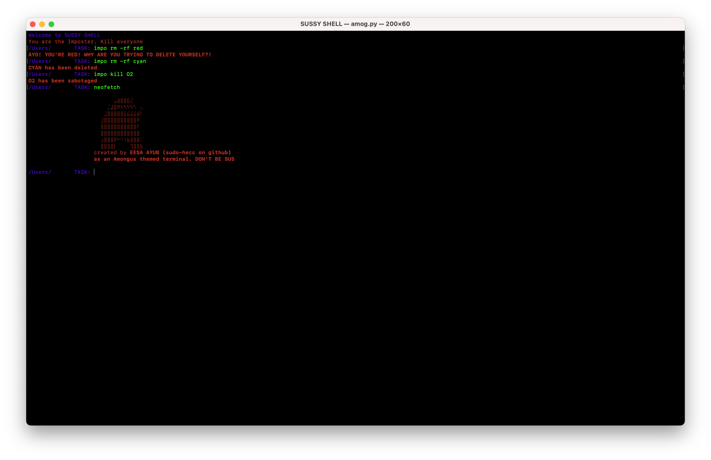
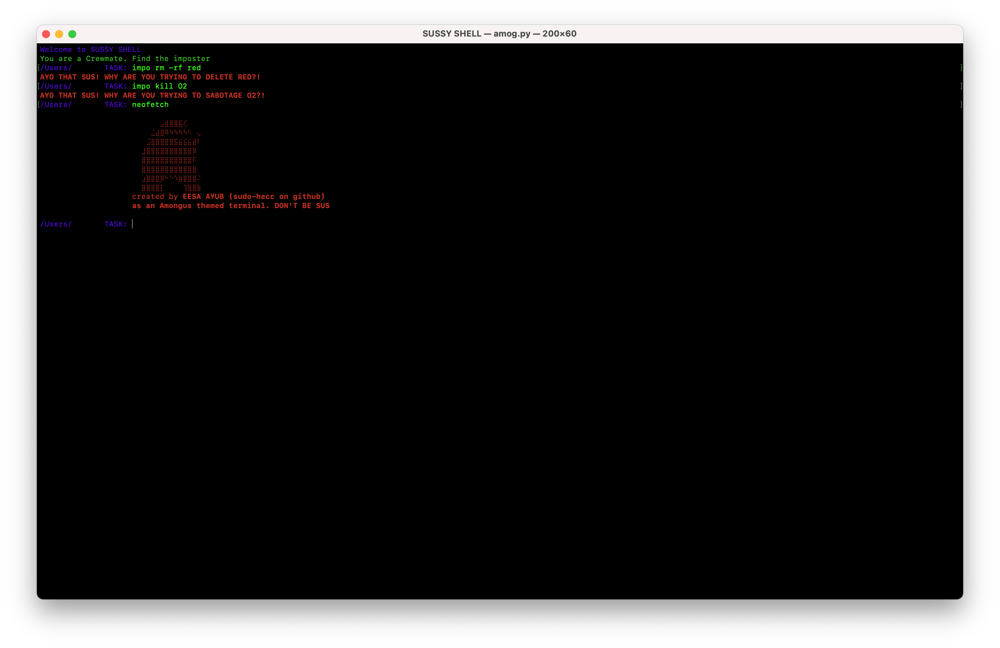

# Among-Us Shell




A custom terminal interface written in Python, designed to simulate a minimal command-line shell environment with themed responses and core command support. Developed as a learning project by [Eesa Ayub (sudo-hecc)](https://github.com/sudo-hecc), this shell features dynamic command execution, path navigation, and a themed startup experience.

---

## Features

- Command-line interface written in Python
- Role assignment (Imposter or Crewmate) for contextual prompts
- Runs standard shell commands using `os.system()`
- Recognizes and handles:
  - `cd` (with tilde `~` expansion)
  - `clear`
  - `exit`
  - `neofetch` (custom ASCII output)
  - Custom `impo rm -rf <target>` to kill (`rm -rf` means delete) crew mate but stops red from killing itself (because it's the **imposter**)
  - Custom `impo kill <target>` to stop - or `kill` - the process of the target (basically **sabotaging**)
- Displays working directory in the prompt
- Uses [`rich`](https://github.com/Textualize/rich) for styled terminal output
- Uses [`pygame`](https://github.com/pygame/pygame) for theme tune

---

## Requirements

- Python 3.8+
- `rich`
- `pygame`
- A `themetune.mp3` file or `pygame` error may show. It can be found at [voicemod](https://tuna.voicemod.net/sound/24225899-3086-47e3-a873-1464e84586cf). Rename to `themetune.mp3`

Install dependencies:

```bash
pip3 install -r requirements.txt
```
or
```powershell
pip install -r requirements.txt
```
---

## If you want to have this as default terminal...
It is simple: just make the startup command:
```bash
python3 /path/to/amog.py
```
or download the `amog.bat` or `amog.command` file that is available from vesion 4.0 onwards.

---

## License
This project is licensed under the [MIT License](./LICENSE.md). See the LICENSE file for details.

---

## `CREDITS.md`
Credits can be viewed at [`CREDITS.md`](./CREDITS.md)

---

## Thanks to the creators of Amog OS for the idea.
**Also, this might be a good shell for Amog OS users or anyone who does a lot of python work in a terminal (works best for Unix terminals)**

# DO NOT BE SUS 🤨
